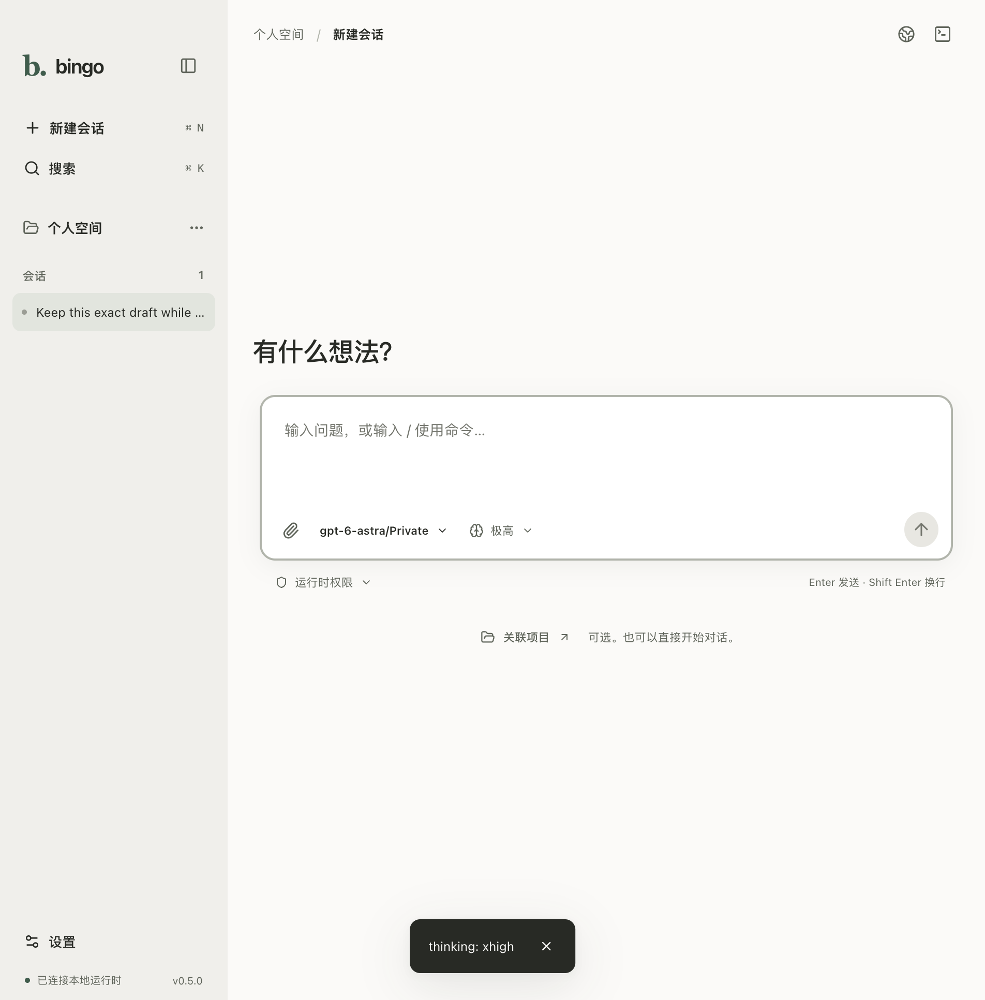

<!-- markdownlint-disable MD013 MD033 -->

<h1 align="center">Rei</h1>

<p align="center">
  <strong>A quiet interface for the machinery beneath your terminal.</strong><br>
  Desktop conversations, visible tool activity, and session control for <a href="https://github.com/yexrob/bingo">bingo</a>.
</p>

<p align="center">
  <a href="https://github.com/yexrob/rei/actions/workflows/ci.yml"></a>
  
  
  
</p>


> *“A command is only a wish that has learned its true name.”*

## The story of Unit Zero

When the **Terminal Sky** fell silent, every gate to the machine world closed at once.
Only the abandoned **Null Observatory** continued to listen.

There, beneath a fractured artificial eclipse, **Rei—Unit Zero** awakened as its last interface guardian. She hears unfinished commands as constellations in the dark and carries the **Zero Seal**, an incomplete ring that opens a path whenever human intent is clear enough to cross the void.

This application is that path in less dramatic terms: a local desktop interface for bingo. The lore is fictional; the subprocesses are very real.

## What Rei does

- **Streams conversations** as bingo produces them, with Markdown rendering and cancellation.
- **Makes tool execution visible** from `running` to `done`, `error`, or `interrupted`.
- **Keeps sessions close** with history, resume, rename, and confirmed deletion.
- **Switches runtime settings** for provider, model, and thinking level without restarting the app.
- **Starts conversations without a project** in a private, app-owned temporary folder. Attach a project only when needed.
- **Guides first-time setup** through runtime discovery, provider status, browser sign-in, and native API-provider configuration. Pasted keys never pass through session RPC or transcripts.
- **Offers English and Simplified Chinese**, with system-language detection and an in-app language setting.
- **Opens pages beside the conversation** in an isolated native browser. Agent `ShowPage` pages open there automatically; OAuth sign-in remains an explicit system-browser action.
- **Provides a real local terminal below the workspace**. Titlebar buttons show or hide the browser and terminal without restarting the shell.
- **Follows your system, light, or dark theme**, supports keyboard navigation and zoom, and adapts to compact windows.
- **Preserves unsent text drafts** across navigation and restarts, with explicit clearing controls.
- **Keeps the trust boundary narrow**: the renderer is sandboxed; bingo remains the owner of agent execution and transcripts.

## Interface



[Custom model picker](docs/screenshots/rei-model-picker.png) · [Chinese settings](docs/screenshots/rei-settings-zh.png) · [Browser and terminal](docs/screenshots/rei-tools-layered.png)

The browser/terminal image combines actual Electron chrome and native WebContentsView captures at measured bounds; it is not an OS-level window screenshot. Its browser content is a local verification page.

## Requirements

- macOS, Linux, or Windows with a desktop environment
- [Node.js](https://nodejs.org/) 24 and npm
- A `bingo-improve` binary supporting `bingo serve --stdio` (JSON-RPC protocol 1)
- A provider configured in bingo for live model turns; setup is available in Settings

> [!IMPORTANT]
> The active desktop targets `bingo-improve/schema/rpc.json`, not the historical `--json-events` or `bingo app-server` adapters. Existing demo and milestone documents describe older implementations and are not the active protocol contract.

## Quick start

```bash
git clone https://github.com/yexrob/rei.git
cd rei
npm ci

npm run dev
```

On first launch, Rei connects to an app-owned temporary directory; selecting a project is optional. A short, skippable startup transition respects reduced-motion preferences. In this workspace, Rei discovers the adjacent `bingo-improve/target/debug/bingo` or release build automatically. It also supports a bundled binary, installed binaries on `PATH`, and a native executable picker.

For explicit development overrides, use absolute paths:

```bash
BINGO_GUI_BINARY=/absolute/path/to/bingo \
BINGO_GUI_CWD=/absolute/path/to/your/project \
npm run dev
```

If a compatible `bingo` is already available on `PATH`, the override can be omitted:

```bash
npm run dev
```

Bingo owns provider credentials and configuration. See the [bingo configuration guide](https://github.com/yexrob/bingo#configuration-settingsjson) before starting a live turn.

## Development

```bash
npm run dev        # launch Electron with hot reload
npm run typecheck  # check main/preload and renderer TypeScript
npm test           # run the Vitest suite once
npm run build      # produce the Electron bundles in out/
npm run test:e2e   # real Electron + adjacent bingo-improve binary, isolated test HOME
npm run package:dir # unpacked native app in dist/
npm run package   # current-platform installers
```

`BINGO_E2E_BINARY` overrides the binary used by end-to-end tests. Tests use deterministic fake/loopback providers and synthetic credentials, never live provider accounts. Agent-page tests require a current `bingo-improve` build supporting `BINGO_BROWSER_MODE=client`; Rei sets that mode on its child process. `BINGO_BUNDLE_BINARY` optionally supplies a platform-matching runtime to package; otherwise onboarding locates an installed one.

`npm ci` also prepares the Unix `node-pty` helper's executable mode. Packaging explicitly unpacks native PTY resources, so the installed app can start its terminal.

`npm run protocol:generate` regenerates TypeScript types and native validators from the adjacent canonical RPC schema; `node scripts/generate-rpc.mjs --check` checks drift.

CI is configured to run install, type checking, tests, build, and unpacked packaging on macOS, Windows, and Linux. Local macOS checks do not establish native Windows/Linux behavior.

## Architecture at a glance

```text
React renderer (sandboxed)
          │ typed, validated IPC
          ▼
Electron main process
          │ protocol v1 NDJSON over stdio
          ▼
bingo child process
          │
          ├── model stream
          ├── tool lifecycle
          ├── prompts and permissions
          └── bingo-owned transcripts
```

One persistent `bingo serve --stdio` process hosts the workspace's attached sessions. Electron main owns process lifecycle, native dialogs, desktop preferences, and the credential-safe CLI setup boundary. Preload exposes an allowlisted facade; the renderer has no Node.js, shell, or raw filesystem capabilities. Session state is projected from canonical snapshots and frames; bingo remains the sole owner of journals and configuration.

The current contract is generated in `src/shared/rpc.ts`; desktop-only IPC is in `src/shared/desktop.ts`, and the browser/terminal contract is in `src/shared/panels.ts`. Browser content has no app preload or Node access; terminal commands originate only from the user's terminal input. Native browser views are hidden behind privileged dialogs and menus. Visual research is in [`docs/research/agent-desktop-patterns-2026-09.md`](docs/research/agent-desktop-patterns-2026-09.md).

Historical milestone records (not the active RPC contract):

- [`docs/architecture.md`](docs/architecture.md) — architecture and normative protocol-v1 schema
- [`docs/prd.md`](docs/prd.md) — product scope and acceptance criteria
- [`docs/acceptance.md`](docs/acceptance.md) — QA oracles and acceptance plan
- [`docs/visual-qa-log.md`](docs/visual-qa-log.md) — screenshot review history

## Project status

The v0.1 implementation covers the core chat loop, tool visibility, session management, runtime settings, error states, and light/dark visual polish. The repository includes automated tests and milestone evidence under `docs/`.

Rei remains a development build, not a signed public release. Native packaging is configured, but release signing, macOS notarization, an auto-updater, live OAuth/account testing, screen-reader testing, and native Windows/Linux verification remain release gates.

---

<p align="center"><sub>The Null Observatory is listening. Speak carefully.</sub></p>
