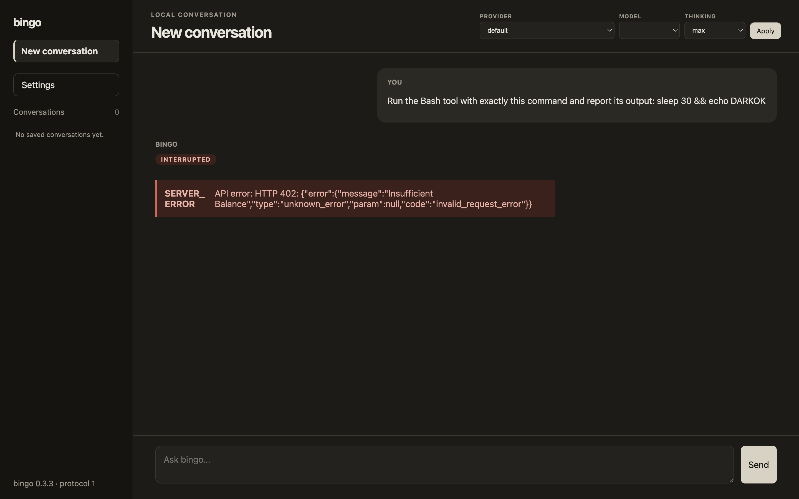

<!-- markdownlint-disable MD013 MD033 -->

<h1 align="center">Rei</h1>

<p align="center">
  <strong>A quiet interface for the machinery beneath your terminal.</strong><br>
  Desktop conversations, visible tool activity, and session control for <a href="https://github.com/yexrob/bingo">bingo</a>.
</p>

<p align="center">
  <a href="https://github.com/yexrob/rei/actions/workflows/ci.yml"></a>
  
  
  
</p>


> *“A command is only a wish that has learned its true name.”*

## The story of Unit Zero

When the **Terminal Sky** fell silent, every gate to the machine world closed at once.
Only the abandoned **Null Observatory** continued to listen.

There, beneath a fractured artificial eclipse, **Rei—Unit Zero** awakened as its last interface guardian. She hears unfinished commands as constellations in the dark and carries the **Zero Seal**, an incomplete ring that opens a path whenever human intent is clear enough to cross the void.

This application is that path in less dramatic terms: a local desktop interface for bingo. The lore is fictional; the subprocesses are very real.

## What Rei does

- **Streams conversations** as bingo produces them, with Markdown rendering and cancellation.
- **Makes tool execution visible** from `running` to `done`, `error`, or `interrupted`.
- **Keeps sessions close** with history, resume, rename, and confirmed deletion.
- **Switches runtime settings** for provider, model, and thinking level without restarting the app.
- **Edits bingo settings safely** through validated, atomic user-layer writes with backups.
- **Follows your light or dark theme** and remains usable down to an 800 × 600 window.
- **Keeps the trust boundary narrow**: the renderer is sandboxed; bingo remains the owner of agent execution and transcripts.

## Interface



## Requirements

- macOS, Linux, or Windows with a desktop environment
- [Node.js](https://nodejs.org/) 24 and npm
- A protocol-v1-compatible `bingo` binary with `--json-events` support
- A provider configured in bingo for live model turns

> [!IMPORTANT]
> Rei currently targets bingo's protocol-v1 adapter. The public bingo `main` branch may not include `--json-events` yet, so an ordinary release binary can show `BINGO_PROTOCOL_UNSUPPORTED`. Point `BINGO_GUI_BINARY` to a compatible build until that adapter lands upstream.

## Quick start

```bash
git clone https://github.com/yexrob/rei.git
cd rei
npm ci

BINGO_GUI_BINARY=/absolute/path/to/protocol-v1/bingo npm run dev
```

`BINGO_GUI_BINARY` must be an absolute executable path. Rei uses the current directory as bingo's workspace by default. To open another project, set `BINGO_GUI_CWD` as well:

```bash
BINGO_GUI_BINARY=/absolute/path/to/bingo \
BINGO_GUI_CWD=/absolute/path/to/your/project \
npm run dev
```

If a compatible `bingo` is already available on `PATH`, the override can be omitted:

```bash
npm run dev
```

Bingo owns provider credentials and configuration. See the [bingo configuration guide](https://github.com/yexrob/bingo#configuration-settingsjson) before starting a live turn.

## Development

```bash
npm run dev        # launch Electron with hot reload
npm run typecheck  # check main/preload and renderer TypeScript
npm test           # run the Vitest suite once
npm run build      # produce the Electron bundles in out/
```

CI runs `npm ci`, type checking, tests, and the production build on every pull request and push to `main` or `dev`.

## Architecture at a glance

```text
React renderer (sandboxed)
          │ typed, validated IPC
          ▼
Electron main process
          │ protocol v1 NDJSON over stdio
          ▼
bingo child process
          │
          ├── model stream
          ├── tool lifecycle
          ├── prompts and permissions
          └── bingo-owned transcripts
```

One persistent bingo child belongs to the active conversation. Electron main owns process lifecycle and trusted filesystem access; the preload exposes only an allowlisted facade; the renderer receives no Node.js, shell, or raw filesystem capabilities.

The complete contracts and decision record live in:

- [`docs/architecture.md`](docs/architecture.md) — architecture and normative protocol-v1 schema
- [`docs/prd.md`](docs/prd.md) — product scope and acceptance criteria
- [`docs/acceptance.md`](docs/acceptance.md) — QA oracles and acceptance plan
- [`docs/visual-qa-log.md`](docs/visual-qa-log.md) — screenshot review history

## Project status

The v0.1 implementation covers the core chat loop, tool visibility, session management, runtime settings, error states, and light/dark visual polish. The repository includes automated tests and milestone evidence under `docs/`.

Rei is still a source-first developer build: there are no packaged releases or auto-updater yet, and it requires a compatible bingo protocol-v1 binary.

---

<p align="center"><sub>The Null Observatory is listening. Speak carefully.</sub></p>
