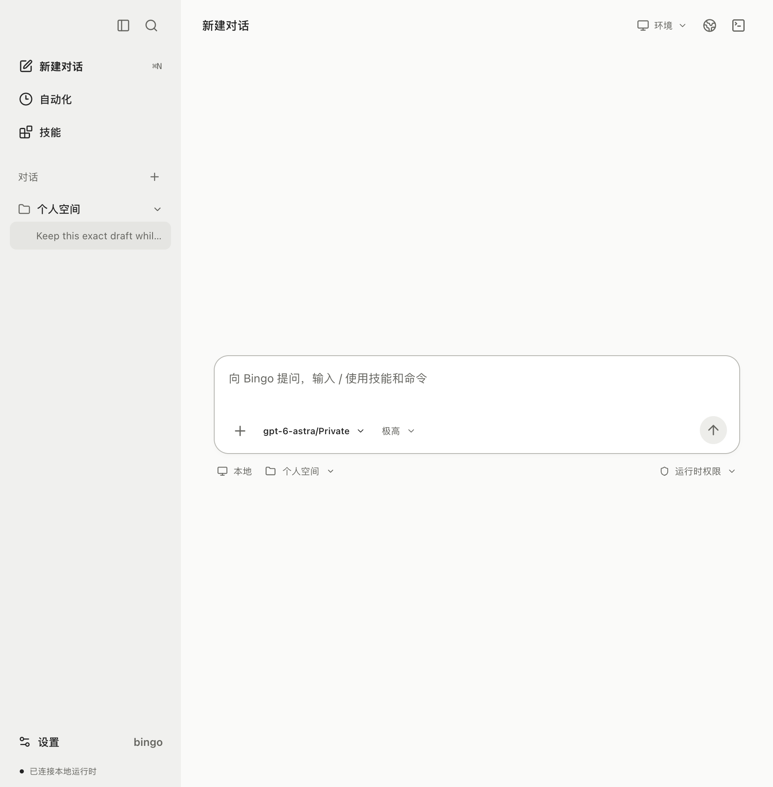

<!-- markdownlint-disable MD013 MD033 -->

<h1 align="center">Rei</h1>

<p align="center">
  <strong>A quiet interface for the machinery beneath your terminal.</strong><br>
  Desktop conversations, visible tool activity, and session control for <a href="https://github.com/yexrob/bingo">bingo</a>.
</p>

<p align="center">
  <a href="https://github.com/yexrob/rei/actions/workflows/ci.yml"></a>
  
  
  
</p>


> *“A command is only a wish that has learned its true name.”*

## The story of Unit Zero

When the **Terminal Sky** fell silent, every gate to the machine world closed at once.
Only the abandoned **Null Observatory** continued to listen.

There, beneath a fractured artificial eclipse, **Rei—Unit Zero** awakened as its last interface guardian. She hears unfinished commands as constellations in the dark and carries the **Zero Seal**, an incomplete ring that opens a path whenever human intent is clear enough to cross the void.

This application is that path in less dramatic terms: a local desktop interface for bingo. The lore is fictional; the subprocesses are very real.

## What Rei does

- **Streams conversations** as bingo produces them, with incremental `markstream-react` Markdown rendering and cancellation.
- **Reviews tracked Git changes** in a read-only side pane, with staged/unstaged scopes and feedback added to an unsent draft.
- **Surfaces skills and automations** from the connected runtime. New automations are prepared as agent requests, not silently saved by the GUI.
- **Presents tools by purpose**: clickable recorded file/source/diff previews, terminal output, search results, and agent/task/schedule receipts, with one consistent MCP/unknown-tool view. Raw diagnostics remain expandable; source previews never execute HTML or read the current file from disk.
- **Keeps live progress beside the stream** with a reduced-motion-aware beam indicator, without pulling readers away from older messages.
- **Keeps agents and rooms in view** through a compact Environment panel and stable hover list of journal activity. Switching an agent changes the conversation and composer target together; every conversation keeps its own draft. Rooms show signed messages, members, mentions, and closed-room state without model controls.
- **Renders rich media safely**: captured journal images, Mermaid diagrams and KaTeX math, with click-to-load external images and inert raw HTML.
- **Keeps sessions close** with history, resume, rename, and confirmed deletion.
- **Switches runtime settings** for provider, model, and thinking level without restarting the app.
- **Starts conversations without a project** in a private, app-owned temporary folder. Attach a project only when needed.
- **Guides first-time setup** through runtime discovery, provider status, browser sign-in, and native API-provider configuration. Pasted keys never pass through session RPC or transcripts.
- **Offers English and Simplified Chinese**, with system-language detection and an in-app language setting.
- **Opens pages beside the conversation** in an isolated native browser. Agent `ShowPage` pages open there automatically; OAuth sign-in remains an explicit system-browser action.
- **Provides independent local terminal tabs below the workspace**. Hiding the area preserves shells and buffers; exiting a shell closes its tab.
- **Follows your system, light, or dark theme**, supports keyboard navigation and zoom, and adapts to compact windows.
- **Preserves unsent text drafts** across navigation and restarts, with explicit clearing controls.
- **Keeps the trust boundary narrow**: the renderer is sandboxed; bingo remains the owner of agent execution and transcripts.

## Interface



[Custom model picker](docs/screenshots/rei-model-picker.png) · [Chinese settings](docs/screenshots/rei-settings-zh.png) · [Browser and terminal](docs/screenshots/rei-tools-layered.png)

The browser/terminal image combines actual Electron chrome and native WebContentsView captures at measured bounds; it is not an OS-level window screenshot. Its browser content is a local verification page.

## Requirements

- macOS, Linux, or Windows with a desktop environment
- A provider configured in bingo for live model turns; setup is available in Settings

[Preview installers](https://github.com/yexrob/rei/releases) include the matching bingo runtime. Installed users do not need Node.js, Rust or a separately installed CLI. macOS v0.1.1 previews are ad-hoc signed, not Developer ID signed or notarized; Windows previews are not publisher-signed. Verify the published checksums and read the release notes before installing. Downloaded macOS copies still require per-app approval in System Settings → Privacy & Security → Open Anyway; never disable system security globally.

Running from source additionally requires [Node.js](https://nodejs.org/) 24.15 or newer on the 24.x line, or Node.js 26+, npm, and a `bingo-improve` binary supporting `bingo serve --stdio` (JSON-RPC protocol 1).

> [!IMPORTANT]
> The active desktop targets `bingo-improve/schema/rpc.json`, not the historical `--json-events` or `bingo app-server` adapters. Existing demo and milestone documents describe older implementations and are not the active protocol contract.

## Quick start

```bash
git clone https://github.com/yexrob/rei.git
cd rei
npm ci

npm run dev
```

On first launch, Rei connects to an app-owned temporary directory; selecting a project is optional. A short, skippable startup transition respects reduced-motion preferences. In this workspace, Rei discovers the adjacent `bingo-improve/target/debug/bingo` or release build automatically. It also supports a bundled binary, installed binaries on `PATH`, and a native executable picker.

For explicit development overrides, use absolute paths:

```bash
BINGO_GUI_BINARY=/absolute/path/to/bingo \
BINGO_GUI_CWD=/absolute/path/to/your/project \
npm run dev
```

If a compatible `bingo` is already available on `PATH`, the override can be omitted:

```bash
npm run dev
```

Bingo owns provider credentials and configuration. See the [bingo configuration guide](https://github.com/yexrob/bingo#configuration-settingsjson) before starting a live turn.

## Development

```bash
npm run dev        # launch Electron with hot reload
npm run typecheck  # check main/preload and renderer TypeScript
npm test           # run the Vitest suite once
npm run build      # produce the Electron bundles in out/
npm run test:e2e   # real hidden Electron + bingo, isolated HOME; no foreground windows
npm run package:dir # unpacked native app in dist/
npm run package   # current-platform installers
```

`BINGO_E2E_BINARY` overrides the binary used by end-to-end tests. Tests use deterministic fake/loopback providers and synthetic credentials, never live provider accounts. Agent-page tests require a current `bingo-improve` build supporting `BINGO_BROWSER_MODE=client`; Rei sets that mode on its child process.

Electron E2E runs **hidden and non-activating by default**, not merely as a background shell job. The shared launcher supplies a temporary isolated HOME/userData and matching test marker; development and packaged verification keep a real painting renderer, sandbox/context isolation/web security, and audits native visibility/focus. On macOS the test app uses the `prohibited` activation policy. Unexpected native dialogs fail instead of appearing; teardown explicitly authorizes stopping only the isolated fixture. Renderer copy actions use an in-memory test sink: exact copied text is checked, but this is **not OS clipboard coverage** and never replaces your clipboard.

```bash
BINGO_E2E_BINARY=/absolute/path/to/bingo npm run test:e2e
# Small no-provider hidden-renderer/IPC checks after building:
npx playwright test tests/background.e2e.ts tests/event-delivery.e2e.ts
```

The native WebContentsView/`sendInputEvent` interaction test is skipped by default because it requires OS-focused input. After obtaining permission to use the foreground, set `REI_E2E_FOREGROUND=1` and select that test explicitly. That opt-in can show windows and take focus; do not enable it on someone's active desktop without agreement. DOM clicks are not substituted for native input. Screenshots from the default mode are real hidden Chromium renders, not OS-level window captures. Finite UI animations are allowed to settle before visual/accessibility checks; indefinite working animations are not awaited.

### Packaging includes bingo

Both `npm run package` and `npm run package:dir` **always include a native bingo runtime** in `resources/bin/bingo` (`bingo.exe` on Windows; `Contents/Resources/bin/bingo` on macOS). Direct `electron-builder` calls run the same required preparation and validation hooks. An installed CLI is not a prerequisite for packaged users: bundled discovery is the default. A user-selected external binary or `BINGO_GUI_BINARY` remains an optional override; clearing the saved selection returns to default discovery without ignoring an intentional environment override.

By default, packaging builds the sibling `../bingo-improve` source with Rust: `cargo build --release --locked --package bingo`, an explicit native target triple, and that checkout's `target/` directory. This requires Rust and the sibling source; it never substitutes an arbitrary executable from `PATH` or downloads an unverified binary. To reuse an already built matching runtime (as release CI does), provide an absolute path:

```bash
BINGO_BUNDLE_BINARY=/absolute/path/to/bingo npm run package:dir
# Optional preflight, also performed automatically by the packaging hook:
BINGO_BUNDLE_BINARY=/absolute/path/to/bingo npm run bundle:prepare
```

To smoke-test the actual unpacked application with an isolated fake-provider profile and no external binary override, set `BINGO_TEST_PACKAGED_APP` to its native application executable and run `REI_E2E_FOREGROUND=0 npx playwright test tests/bundled-runtime.e2e.ts`. On macOS the executable is typically `dist/mac-arm64/Rei.app/Contents/MacOS/Rei`. The launcher checks the packaged main entry for the hidden guard before starting; older packages without it are refused. The test checks bundled discovery, connection, a streamed response and the native terminal without showing or focusing windows. It is skipped only when no packaged executable is supplied.

macOS packaging uses electron-builder's built-in ad-hoc signing (`identity: '-'`) with its scoped Electron entitlements and no notarization. The `afterSign` hook verifies every native component and the sealed app; recheck an existing bundle with `node scripts/verify-mac-signature.cjs /absolute/path/to/Rei.app`.

The hook rejects missing files, scripts, wrong operating systems/architectures, and unsupported targets before packaging. On a matching native host it also verifies `bingo serve --stdio` initialization (protocol 1 and desktop session methods) and clean shutdown in a temporary, isolated home directory. The unpacked application is checked again after copying, including executable permissions. Failure stops packaging rather than shipping a runtime-less app. Windows uses `bingo.exe`; each installer targets one architecture. Cross-target packaging requires an explicit matching binary and only validates its native header locally—run protocol and end-to-end checks on that target's native runner before release. Universal macOS bundles are not supported by this preparation path.

`npm ci` also prepares the Unix `node-pty` helper's executable mode. Packaging explicitly unpacks native PTY resources, so the installed app can start its terminal.

`npm run protocol:generate` regenerates TypeScript types and native validators from the adjacent canonical RPC schema; `node scripts/generate-rpc.mjs --check` checks drift.

CI is configured to run install, type checking, tests, build, and unpacked packaging on macOS, Windows, and Linux. Local macOS checks do not establish native Windows/Linux behavior.

## Architecture at a glance

```text
React renderer (sandboxed)
          │ typed, validated IPC
          ▼
Electron main process
          │ protocol v1 NDJSON over stdio
          ▼
bingo child process
          │
          ├── model stream
          ├── tool lifecycle
          ├── prompts and permissions
          └── bingo-owned transcripts
```

One persistent `bingo serve --stdio` process hosts the workspace's attached sessions. Electron main owns process lifecycle, native dialogs, desktop preferences, and the credential-safe CLI setup boundary. Preload exposes an allowlisted facade; the renderer has no Node.js, shell, or raw filesystem capabilities. Session state is projected from canonical snapshots and frames; bingo remains the sole owner of journals and configuration.

The current contract is generated in `src/shared/rpc.ts`; desktop-only IPC is in `src/shared/desktop.ts`, and the browser/terminal contract is in `src/shared/panels.ts`. Browser content has no app preload or Node access; terminal commands originate only from the user's terminal input. Native browser views are hidden behind privileged dialogs and menus. Visual research is in [`docs/research/agent-desktop-patterns-2026-09.md`](docs/research/agent-desktop-patterns-2026-09.md).

Historical milestone records (not the active RPC contract):

- [`docs/architecture.md`](docs/architecture.md) — architecture and normative protocol-v1 schema
- [`docs/prd.md`](docs/prd.md) — product scope and acceptance criteria
- [`docs/acceptance.md`](docs/acceptance.md) — QA oracles and acceptance plan
- [`docs/visual-qa-log.md`](docs/visual-qa-log.md) — screenshot review history

## Project status

The v0.1 implementation covers the core chat loop, tool visibility, session management, runtime settings, error states, and light/dark visual polish. The repository includes automated tests and milestone evidence under `docs/`.

Rei is preview software, not a signed stable release. The release workflow builds and checks macOS ARM64/Intel, Windows x64 and Linux x64 before publishing installers. macOS uses verified ad-hoc signatures only. Developer ID/publisher signing, macOS notarization, an auto-updater, live OAuth/account testing and hands-on screen-reader/device testing are not provided by this preview.

---

<p align="center"><sub>The Null Observatory is listening. Speak carefully.</sub></p>
